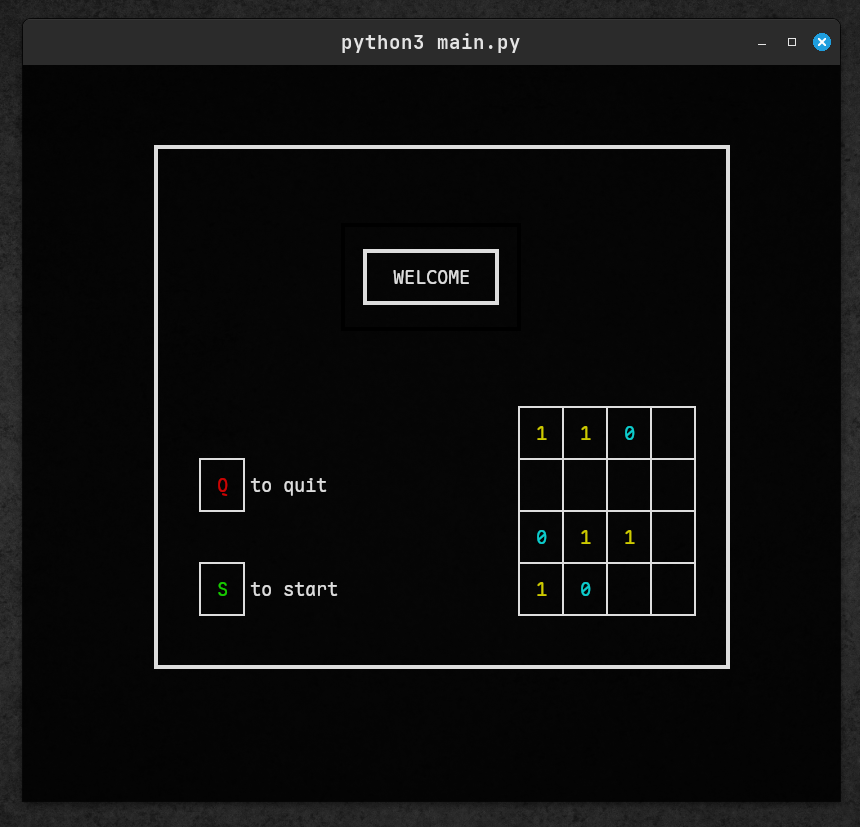
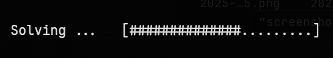
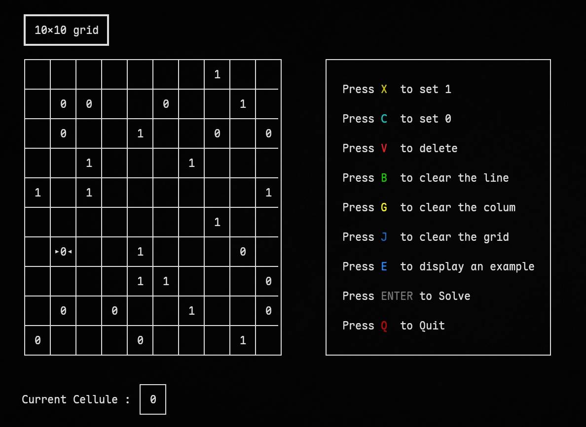
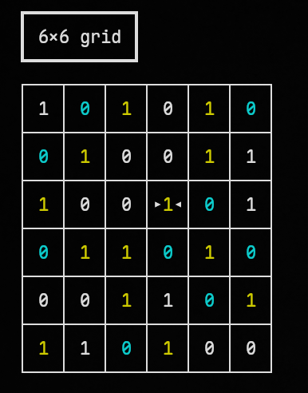

# Binary Puzzle Solver

## Screenshots







This project is a Python-based binary puzzle solver. It utilizes Unicode characters to create and manipulate the puzzle grids, providing a user-friendly and visually appealing interface.


## Prerequisites

- **Python Version**: This project requires Python **3.12.3** or higher.
  - Ensure you have the correct version of Python installed on your system. You can check your version by running:

    ```bash
    python3 --version
    ```
- **Pyinput**: This project requires pyinput library.

    ```bash
    pip install pynput none
    ```
- **Colorama**: This project requires colorama library.

    ```bash
    sudo -H pip install colorama
    ```

## Running the Program

To run the program, you can use the following command in your terminal or command prompt:

```bash
python3 main.py
```


